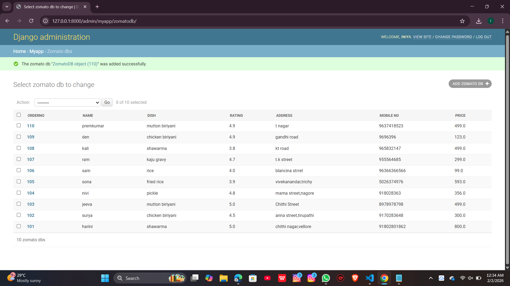

# Ex01 Django ORM Web Application
## Date: 02.02.2026

## AIM
To develop a Django Application to store and retrieve data from a E-Commerce Website Database for Amazon or Flipkart using Object Relational Mapping(ORM).

## DESIGN STEPS

### STEP 1:
Clone the problem from GitHub

### STEP 2:
Create a new app in Django project

### STEP 3:
Enter the code for admin.py and models.py

### STEP 4:
Detect changes and create migration files that describe how to modify the database schema

### STEP 5:
Execute the migration files and update the database schema to match your Django models

### STEP 6:
Create a superuser with full access rights to all models and data through the admin interface.

### STEP 7:
Apply the migration files of the created app to the database

### STEP 8:
Execute Django admin using localhost and create details for 10 entries

## PROGRAM
```
model.py
from django.db import models
from django.contrib import admin
class ZomatoDB(models.Model):
	orderNo=models.IntegerField(primary_key=True);
	Name=models.CharField(max_length=10);
	dish=models.CharField();
	rating=models.FloatField();
	address=models.TextField();
	Mobile_no=models.IntegerField();
        price=models.FloatField()
class StudentDBAdmin(admin.ModelAdmin):
	list_display=['orderNo','Name','dish','rating','address','Mobile_no','price'];

admin.py
from django.contrib import admin

from .models import ZomatoDB,ZomatoDBAdmin
admin.site.register(ZomatoDB,ZomatoDBAdmin)

```


## OUTPUT



## RESULT
Thus the program for creating E-commerce website database using ORM hass been executed successfully
